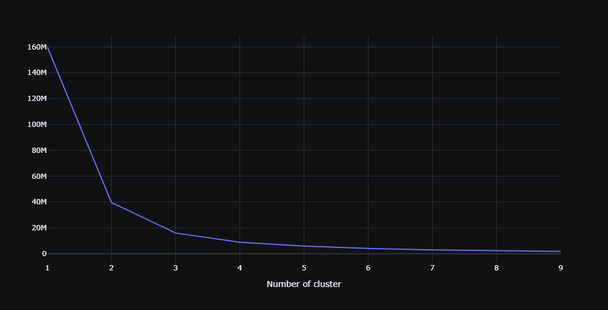
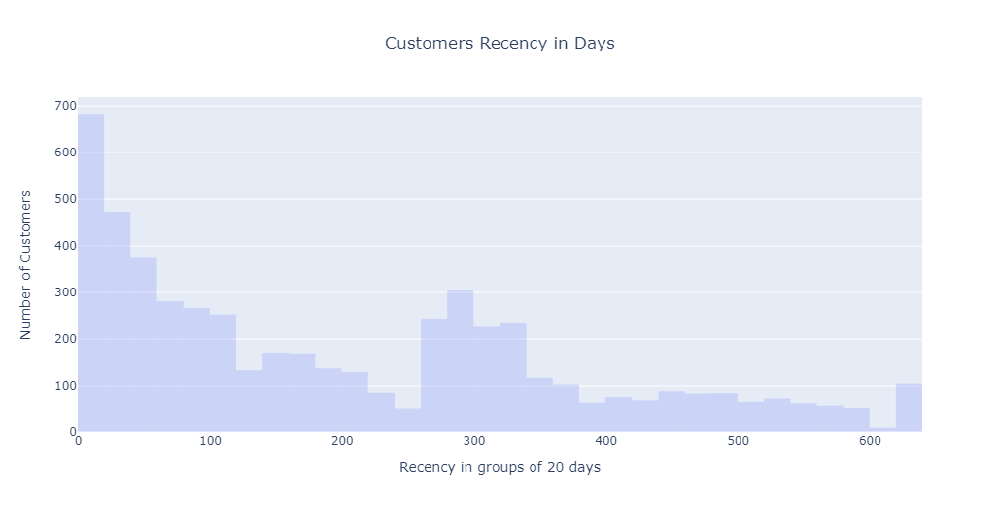
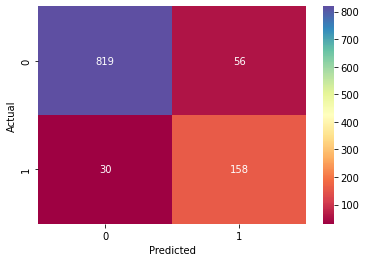

# Predict Customers Purchase

This project aims to predict whether a customer will make a purchase in the next month using historical online retail data. The workflow involves data cleaning, exploratory data analysis, feature engineering, clustering, and machine learning modeling.

## Project Overview
- **Objective:** Predict if a customer will buy a product in the next 90 days.
- **Dataset:** Online retail transactions with fields such as InvoiceNo, StockCode, Description, Quantity, InvoiceDate, UnitPrice, CustomerID, and Country.
- **Approach:**
  1. Data cleaning and preprocessing (handling missing values, type conversions)
  2. Exploratory data analysis (EDA)
  3. Feature engineering
  4. Customer segmentation using KMeans clustering
  5. Model training and evaluation (various classifiers)

## Workflow Summary
1. **Data Cleaning:**
   - Removed rows with missing CustomerID or Description.
   - Converted InvoiceDate to datetime format.
2. **Exploratory Data Analysis:**
   - Analyzed purchase patterns, customer distribution, and product popularity.
3. **Feature Engineering:**
   - Created features such as Recency, Frequency, and Monetary value (RFM analysis).
4. **Clustering:**
   - Used KMeans to segment customers based on RFM features.
   - Determined optimal number of clusters using the Elbow Method.
5. **Modeling:**
   - Trained and evaluated several classifiers (Logistic Regression, Random Forest, SVM, XGBoost, etc.) to predict future purchases.

## Key Results & Visualizations

### 1. Elbow Method for Optimal Clusters

### 2. Customer Segmentation Visualization

### 3. Model Performance Comparison

## How to Use
1. Clone the repository.
2. Install required Python packages (see notebook for details).
3. Run the Jupyter notebook `PCP.ipynb` to reproduce the analysis and results.

## Files
- `PCP.ipynb`: Main analysis and modeling notebook.
- `Data.csv`: Raw dataset.

## License
This project is for educational and demonstration purposes.